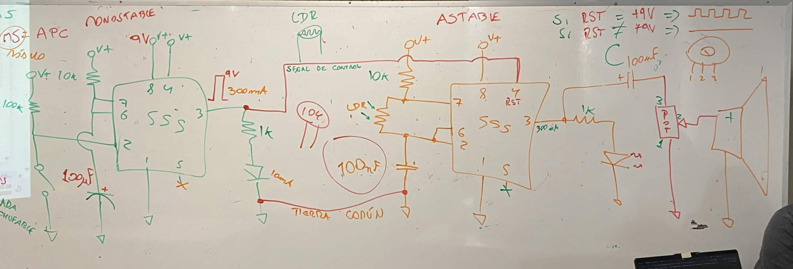
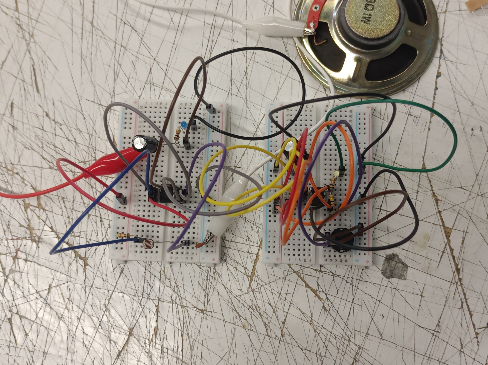

# sesion-04a

# Apuntes 31/03

### Sobre el primer gran proyecto

Se nos informó que el gran proyecto 1 (solemne 1) sería en grupos de tres personas, por lo que se dio el espacio para poder formar grupos (si alguien no tenía grupo al final de la clase, no podía salir). También se informó que estos grupos no son definitivos por todo el semestre, por lo cual podemos cambiar de grupo para los siguintes proyectos grupales.

---

### Circuito astable y monostable

Nos volvieron a mencionar los circuitos astables y monostables, recordando el cómo unimos los dos para lograr hacer el atari punk, y ésta vez íbamos a hacer algo parecido solo que ésta vez teníamos que invertir los circuitos. 

- Atari punk : ``Astable -> Monostable``
- Circuito de hoy: ``Monostable -> Astable``

Misa nos dibujó el esquemático en la pizarra para que podamos recrear los circuitos y nos indicó el cómo teníamos que unirlos.

Con mi compañero nos dividimos el trabajo, por lo que uno trabajó en el monostable (yo) y el otro en el stable (mi compañero) para después conectarlos. En el primer intento a mi compañero le prendía el LED pero no le funcionaba el parlante, y a mi directamente no me prendía el LED, por lo que partimos un poco mal y decidimos volver a hacerlo desde cero y de manera más ordenada siguiendo el orden de los pins del chip. En el segundo intento se volvieron a repetir los mismos errores pero no lograbamos identificar en dónde estabamos fallando, por lo que volvimos a hacerlo desde cero. En el tercer intento, a mi compañero le dejó de prender el LED y yo seguía sin poder prender el mio, por lo que nos empezamos a desesperar un poco ya que podíamos escuchar a compañeros que ya les estaba funcionando y nosotros no podíamos lograr que ninguna de las dos partes funcione, y volvimos a hacerlo desde cero. En el cuarto intento por fin me prendió el LED, pero este se apagaba cuando presionaba el botón y no estoy seguro de si tenía que ser así o al revés (que se prenda cuando se apreta el botón), pero lo consideré una victoria de igual manera.

Como aún lo funcionaba el circuito de mi compañero, probamos cambiando el chip ya que existía la posibilidad de que haya muerto en el proceso, pero al hacer el cambio tampoco funcionó por lo que decimos que era momento de pedir ayuda y mi compañero fue a hablar con Misa. Cuando volvió, nos dimos cuenta de que el problema es que estabamos conectando los dos caimanes al mismo capacitor en vez de tirar un caimán a tierra, y la razón por la cual el LED no prendía es porque se había quemado. Cuando se hicieron todos los cambios, funcionó el circuito astable y por fin pudimos conectar los dos circuitos.

Fue un proceso un poco frustrante ya que tuvimos que volver a hacer los circuitos varias veces desde cero sin lograr identificar el problema, por lo que al poder lograrlo se sintió como una liberación de la cárcel llamada 555 (broma, adoro al chip). Pueden ver el resultado en ./imagenes/circuitos-funcionando.mp4.

---

### Encargo destripar un dispositivo electrónico

Como encargo se nos indicó destripar un dispositivo electrónico, por lo cual nos dieron tres tips:

1. No hacerlo a "pata pelá"
2. No microondas
3. No hacerlo cuando esté enchufado, ni menos con los pies mojados.

Como dispositivo elegí un mouse inalámbrico Genius que hay en mi casa, el cual se encuentra abandonado porque se nos perdió su USB y ahora guarda el USB de otro mouse el cual está perdido en alguna parte de nuestra casa. Para ser honesto, es primera vez que abro un mouse y no podía imaginarme lo que podía estar dentro, hasta que me acordé que hace años había leido en reddit una discusión sobre que los mouse inalámbricos no se deberían llamar mouse, sino hamsters porque éstos no tienen cola. No logré encontrar el post de reddit ya que es muy añejo, pero encontré ésta imagen que ayuda a representar visualmente lo que se estaba discutiendo.

Luego de recordar eso, la verdad me hizo bastante sentido que sea un hamster ya que me puedo imaginar visualmente que para que funcione un mouse internamente deben de haber al menos tres hamsters diminutos trabajando en cada movimiento que uno ejecuta en la carcasa del mouse, los cuales tienen distintos roles:

- Hamster distribuidor de energía (todo depende de él, razón por la cual la pasa bastante mal dentro de sus horarios de trabajo)
- Hamster a cargo de movimientos (clicks y rueda)
- Hamster que se comunica con el otro equipo que trabaja dentro del computador

Como solo hay una pila y son tres hamsters diminutos dentro, un hamster se encarga de recibir toda la energía que le puede dar la pila y ayuda a distribuirla a sus demás compañeros mediante una rueda para correr, la que genera más energía mediante el movimiento, por lo que si éste hamster deja de correr aunque sea por un segundo, sus compañeros pierden la energía lo que explica el por qué suele fallar a veces el mouse por momentos cortos y luego vuelve a la normalidad. Éste trabajo es bastante agotador, por lo que cuando uno deja de usar el mouse, éste hamster se va a descansar y cuesta bastante que responda de manera inmediata cuando uno enciende el mouse ya que está constantemente agotado, lo cual explica el por qué cuando uno enciende el mouse a veces tiene que clickear varias veces seguidas para que logre responder.

Gracias al hamster de la energía, sus dos compañeros pueden realizar sus labores sin problemas, una de éstas siendo la de identificar qué movimientos está haciendo el humano con el dispositivo, qué lugares presiona y en qué dirección mueve la rueda del mouse. El hamster que se encarga de ésto va documentando todo de manera extremadamente rápida y se lo va transmitiendo a su otro compañero que está a cargo de mandar todas las señales al computador al que está conectado el mouse, por lo que tiene un mini computador conectado por bluetooth al USB que está enchufado a nuestro pc, lo que les ahorra el trabajo de tener que salir de la carcasa del mouse y tener que informar cada movimiento que hace el humano a los otros hamsters que están dentro del computador haciendo el mismo trabajo que ellos hacen dentro del mouse, solo que a mayor escala.
